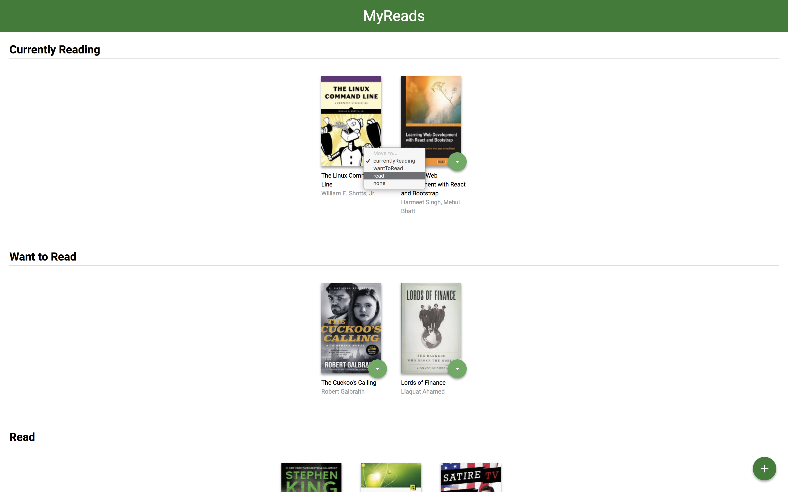
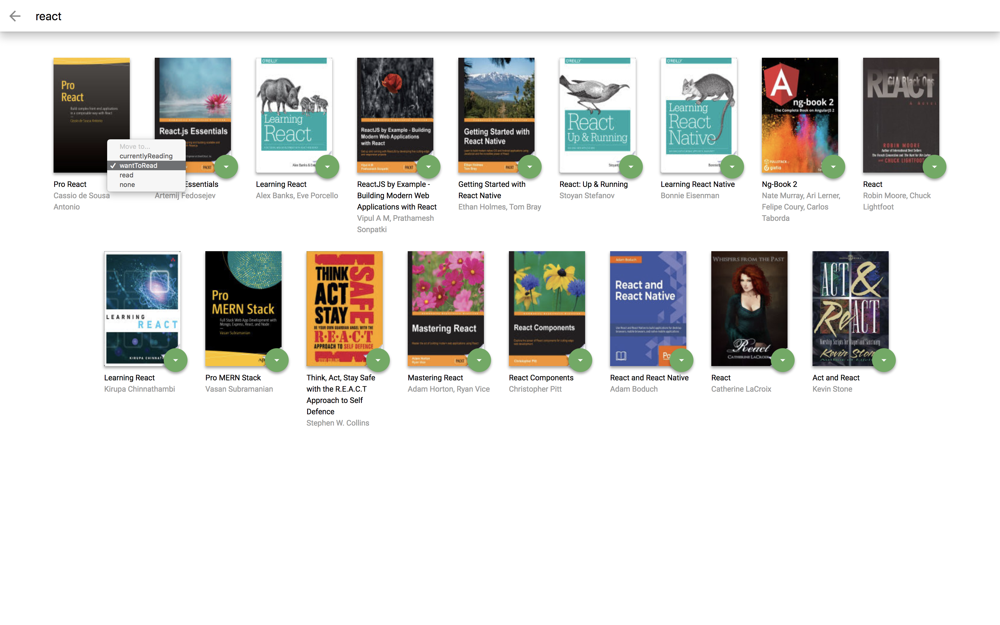

# MyReads Project
React Project -- Udacity React Developer Nanodegree

## TL;DR
This project consists is a bookshelf. User can change book's status, and add new book to shelf.

## Features
### Shelf

User can change book's status among to read, reading, read, and none.

### Search

User can add books to shelf.

## Install
```
1. git clone https://github.com/queuestack/nanodegree-myreads.git
2. cd nanodegree-myreads
3. npm install
4. npm start
```